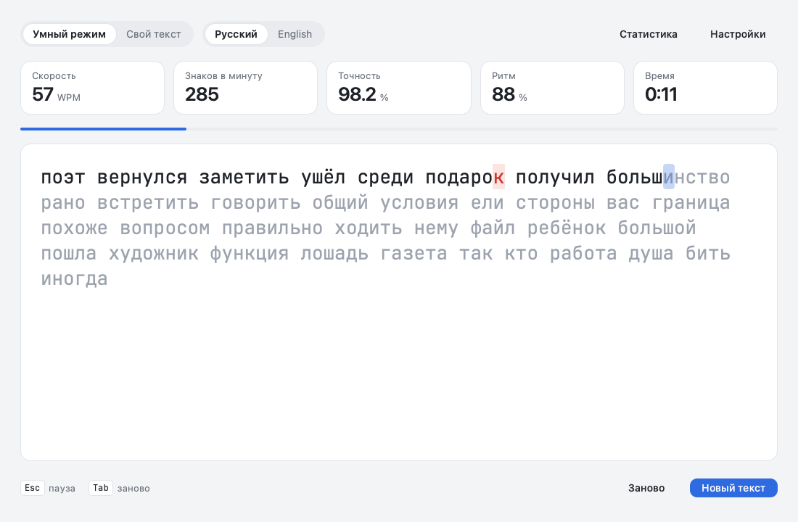
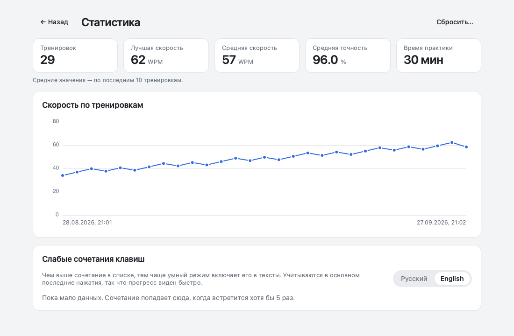
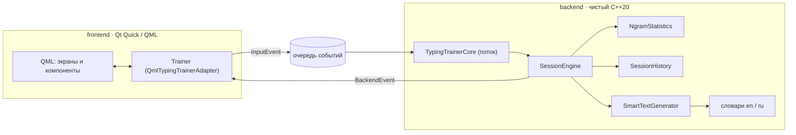

# Typing Trainer

> Десктопный тренажёр слепой печати, который находит ваши слабые сочетания клавиш
> и собирает упражнения именно под них.

[](https://github.com/TihonSotnikov/TypingTrainer/actions/workflows/ci.yml)
[](https://github.com/TihonSotnikov/TypingTrainer/releases/latest)
[](https://en.cppreference.com/)
[-41cd52.svg)](https://www.qt.io/)
[](#установка)
[](LICENSE)



---

## Что это

Большинство тренажёров гоняют всех по одному и тому же тексту. Этот — наоборот:
он измеряет время и ошибки по каждой **n-грамме** (1–3 символа), вычисляет, какие
сочетания даются вам тяжелее всего, и составляет из реальных слов текст, насыщенный
именно ими. Статистика копится между запусками и успевает за вашим прогрессом:
подтянули букву — она уходит из подборки.

Два режима тренировки:

| Режим | Описание |
|-------|----------|
| **Умный** | Текст генерируется из частотного словаря (≈1400 слов на язык) под ваши проблемные сочетания. |
| **Свой текст** | Тренировка на собственном тексте любой длины. |

---

## Возможности

- 🎯 **Адаптивные упражнения** — текст подстраивается под персональные слабые сочетания.
- 🌍 **Русский и английский** — язык переключается прямо на главном экране.
- 📊 **Метрики в реальном времени** — скорость, точность, ритм, время и прогресс.
- 🏁 **Итоги тренировки** — результат, рекорды и слабые места именно этой сессии.
- 📈 **Статистика** — график скорости по тренировкам и слабые сочетания за всё время.
- ⌨️ **Всё с клавиатуры** — старт, рестарт и пауза без мыши.
- ⏸️ **Автопауза** — после 5 секунд без нажатий и при переходе в другое окно.
- 🔤 **Подсказка о раскладке** — нажатия не в той раскладке не засчитываются как ошибки.
- 📝 **Любой свой текст** — «ёлочки», длинные тире, переносы строк автоматически
  приводятся к тому, что есть на клавиатуре; длинные тексты не тормозят.
- 🎨 **Темы** — как в системе, светлая, тёмная и чёрная; настраиваемый размер шрифта.
- 💾 **Локальное хранение** — статистика, история и настройки сохраняются на компьютере,
  без серверов и аккаунтов.

<p>
  
  
</p>

---

## Управление

| Клавиша | Действие |
|---------|----------|
| любая буква | начать печатать — время пойдёт с первого нажатия |
| `Esc` | пауза / продолжить; на экране итогов — показать набранный текст |
| `Tab` | начать этот же текст заново |
| `Enter` | новый текст (если набор ещё не начат или уже закончен) |
| `Backspace` | исправить предыдущий символ |

На паузе достаточно просто продолжить печатать.

---

## Метрики

| Метрика | Что показывает |
|---------|----------------|
| **Скорость (WPM)** | Слов в минуту, слово = 5 верно набранных знаков. |
| **Знаков в минуту (CPM)** | Верно набранных символов в минуту. |
| **Точность** | Доля верных нажатий, %. Исправленная ошибка всё равно остаётся ошибкой. |
| **Ритм** | Насколько ровные интервалы между нажатиями, %: `100 · (1 − tanh(cv + cv³/3 + cv⁵/5))`, где `cv` — коэффициент вариации интервалов. Раздумья дольше 2 с не учитываются. |
| **Время** | Чистое время набора: считается от первого до последнего нажатия, паузы и простой перед ними не входят. |

---

## Как работает умный режим

1. **Сбор статистики.** Каждое нажатие учитывается во всех n-граммах (1–3 символа),
   оканчивающихся на текущем символе эталонного текста: интервал до символа
   (flight time) и была ли ошибка. Контекст строится по эталону, поэтому опечатки
   его не загрязняют. Интервалы после паузы, `Backspace` и дольше 1,5 с не учитываются.
2. **Затухание.** Новое наблюдение весит 1, прежние умножаются на 0,98 — по каждому
   сочетанию важны примерно последние 50 нажатий. Прогресс виден быстро, старые
   ошибки не держат сочетание в топе вечно.
3. **Вес проблемности.** Для каждого сочетания

   $$W = \tilde{T} + \lambda \cdot \tilde{E}$$

   где $\tilde{T}$ — среднее время, а $\tilde{E}$ — доля ошибок, сглаженные к средним
   по всем буквам (5 «воображаемых» наблюдений), чтобы пара случайных промахов не
   выводила редкое сочетание в лидеры. Сочетания, встретившиеся реже 5 раз, отбрасываются.
4. **Генерация.** Берутся 30 худших **буквенных** сочетаний, которые вообще встречаются
   в словах выбранного языка (переходы через пробел, знаки и сочетания другого языка
   пропускаются). Из словаря выбираются слова с этими сочетаниями — чем проблемнее,
   тем вероятнее — и разбавляются обычными словами. Долю обычных слов задаёт
   «Сложность» в настройках. Одно слово не повторяется дважды подряд.

---

## Установка

Готовые сборки — во вкладке
[**Releases**](https://github.com/TihonSotnikov/TypingTrainer/releases/latest):

- **Windows** (x64) — распакуйте `TypingTrainer-*-windows-x64.zip` и запустите
  `TypingTrainer.exe`. Устанавливать ничего не нужно.
- **macOS** (universal: Intel и Apple Silicon, macOS 13+) — откройте `.dmg` и перетащите
  приложение в «Программы». Сборка не нотаризована, поэтому при первом запуске macOS
  его заблокирует: откройте «Системные настройки → Конфиденциальность и безопасность»
  и нажмите «Всё равно открыть» (на старых версиях macOS — ПКМ по приложению → «Открыть»).
- **Linux** (x86_64) —
  `chmod +x TypingTrainer-*-linux-x86_64.AppImage && ./TypingTrainer-*-linux-x86_64.AppImage`.

### Где хранятся данные

Статистика, история тренировок и свой текст лежат в папке данных пользователя
(её можно открыть из настроек):

| ОС | Папка |
|----|-------|
| Windows | `%APPDATA%\TihonSotnikov\TypingTrainer` |
| macOS | `~/Library/Application Support/TihonSotnikov/TypingTrainer` |
| Linux | `~/.local/share/TihonSotnikov/TypingTrainer` |

Переменная окружения `TYPING_TRAINER_DATA_DIR` задаёт другую папку — например, для
портативного запуска с флешки. Статистика из версии 1.0 (файл `ngram_stats.json`
в папке, откуда запускалась программа) переносится автоматически.

---

## Сборка из исходников

**Требования:** CMake 3.21+, компилятор C++20 (GCC 11+, Clang 16+ / Xcode 16+, MSVC 19.30+),
Qt 6.5+ (`Gui Qml Quick QuickControls2`, для UI-тестов — `Test`).
[nlohmann/json](https://github.com/nlohmann/json) и
[GoogleTest](https://github.com/google/googletest) CMake скачает сам, если их нет в системе.

### macOS (Homebrew)

```sh
brew install qt cmake
cmake --preset dev
cmake --build --preset dev
open build/dev/src/frontend/TypingTrainer.app
```

### Linux

Нужен Qt 6.5 или новее: он есть в репозиториях Ubuntu 24.10+, Debian 13, Fedora, Arch.
На более старых дистрибутивах поставьте Qt через
[aqtinstall](https://github.com/miurahr/aqtinstall) или онлайн-установщик Qt.

```sh
sudo apt install build-essential cmake qt6-base-dev qt6-declarative-dev \
  qml6-module-qtquick qml6-module-qtquick-controls qml6-module-qtquick-layouts \
  qml6-module-qtquick-templates qml6-module-qtqml-workerscript qml6-module-qtcore
cmake --preset dev
cmake --build --preset dev
./build/dev/src/frontend/TypingTrainer
```

### Windows (vcpkg)

Зависимости ставятся через [vcpkg](https://github.com/microsoft/vcpkg); переменная
окружения `VCPKG_ROOT` должна указывать на каталог vcpkg.

```powershell
# Установить зависимости (может занять продолжительное время):
vcpkg install qtbase:x64-windows qtdeclarative:x64-windows nlohmann-json:x64-windows

# Собрать и установить в ./dist (или просто запустите build-release.ps1):
cmake --preset vcpkg-release
cmake --build --preset release
cmake --install build/vcpkg-release --prefix "$pwd/dist"
```

Самодостаточный дистрибутив со всеми библиотеками Qt собирает `cmake --install`
(windeployqt / macdeployqt). Готовые пакеты для всех ОС собирает CI — см.
[`.github/workflows/ci.yml`](.github/workflows/ci.yml).

---

## Разработка

| Пресет | Что собирает |
|--------|--------------|
| `dev` | приложение + все тесты (Debug) |
| `core` | только ядро и его тесты — Qt не нужен |
| `vcpkg-debug`, `vcpkg-release` | сборка через vcpkg на Windows |

```sh
cmake --preset dev && cmake --build --preset dev
ctest --preset dev          # тесты ядра (GoogleTest) и интерфейса (Qt Test, без экрана)
```

- **Тесты ядра** (`tests/*_test.cpp`) проверяют статистику, генератор, словари,
  хранение данных и машину состояний сессии — детерминированно, с заданным временем нажатий.
- **UI-тесты** (`tests/ui`) запускают настоящий интерфейс с `QT_QPA_PLATFORM=offscreen`
  и печатают через эмуляцию клавиатуры. С переменной `TT_SCREENSHOT_DIR=<папка>` они
  сохраняют скриншоты — так сделаны картинки в этом README.
- **Стиль** — `.clang-format` и `.clang-tidy` в корне; QML проверяется целью
  `typing_trainer_ui_qmllint`.
- **Релиз** — поднять версию в `CMakeLists.txt`, описать изменения в
  [`CHANGELOG.md`](CHANGELOG.md) и запушить тег `vX.Y.Z`: CI соберёт пакеты и опубликует релиз.

---

## Архитектура

Проект разделён на два слоя, общающихся через единственный контракт
[`src/contracts.hpp`](src/contracts.hpp): фронтенд не знает о внутренностях ядра, ядро не
знает о Qt.



- **`backend/`** — чистый C++20 без Qt.
  `SessionEngine` — синхронная машина состояний тренировки и метрики;
  `TypingTrainerCore` — фоновый поток и потокобезопасные очереди вокруг неё;
  `NgramStatistics` — статистика n-грамм с затуханием и весами;
  `SmartTextGenerator` — генерация текста; `SessionHistory` — история тренировок;
  `json_storage` — атомарная запись файлов; `text_utils` — нормализация текста и алфавиты.
- **`frontend/`** — Qt Quick/QML. `Trainer` (синглтон `QmlTypingTrainerAdapter`) переводит
  действия пользователя в `InputEvent`, а события ядра — в свойства QML. QML-модуль
  собран статической библиотекой, чтобы его загружали и приложение, и UI-тесты.

Обмен асинхронный: UI кладёт `InputEvent` в очередь, фоновый поток обрабатывает его и
возвращает `BackendEvent` — снимок состояния, дельту по символу, итоги тренировки,
статистику или предупреждение о раскладке. UI никогда не блокируется на вычислениях.

---

## Структура проекта

```text
TypingTrainer/
├── src/
│   ├── contracts.hpp                # единственный контракт между слоями
│   ├── concurrent_queue.hpp         # потокобезопасная очередь событий
│   ├── backend/                     # ядро на чистом C++20 (без Qt)
│   │   ├── session_engine.*         # машина состояний тренировки и метрики
│   │   ├── typing_trainer_core.*    # фоновый поток и очереди
│   │   ├── ngram_statistics.*       # статистика n-грамм, веса, JSON
│   │   ├── smart_text_generator.*   # генерация текста под слабые сочетания
│   │   ├── session_history.*        # история тренировок
│   │   ├── dictionaries.* + dictionaries/*.txt  # словари en/ru
│   │   └── json_storage.*, text_utils.*, metrics.hpp
│   └── frontend/                    # Qt Quick / QML
│       ├── main.cpp
│       ├── typing_trainer_adapter.* # синглтон Trainer: мост QML ↔ ядро
│       ├── qml/                     # экраны и компоненты интерфейса
│       └── fonts/                   # JetBrains Mono (OFL)
├── tests/                           # GoogleTest (ядро) и Qt Test (интерфейс)
├── packaging/                       # иконки, ресурсы Windows, ярлык Linux
├── docs/screenshots/
├── .github/workflows/               # CI и выпуск релизов
├── CMakeLists.txt, CMakePresets.json
└── build-*.ps1                      # вспомогательные скрипты сборки (Windows)
```

---

## Планы

- [ ] Режим с заглавными буквами, цифрами и знаками препинания в умных текстах.
- [ ] Новые языки и раскладки.
- [ ] Упражнения на отдельные ряды клавиатуры для новичков.
- [ ] Экспорт статистики.

История изменений — в [CHANGELOG.md](CHANGELOG.md).

---

## Команда

| Слой | Разработчик | Зона ответственности |
|------|-------------|----------------------|
| **Backend** | Тихон Сотников | Ядро сессии, машина состояний, метрики, алгоритм n-грамм, Smart-генератор, JSON-персистентность, потоковая модель. |
| **Frontend** | Андрей Червов | UI на Qt Quick/QML, адаптер `QObject`, обработка ввода, отрисовка текста и курсора, темы, метрики. |

Граница между зонами — контракт [`src/contracts.hpp`](src/contracts.hpp); изменения
согласуются только через него.

---

## Лицензия

Проект распространяется под лицензией MIT — см. [LICENSE](LICENSE).
Шрифт JetBrains Mono — под лицензией SIL Open Font License 1.1
([src/frontend/fonts/OFL.txt](src/frontend/fonts/OFL.txt)).
