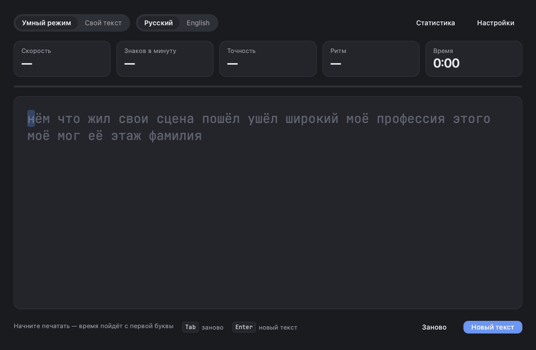
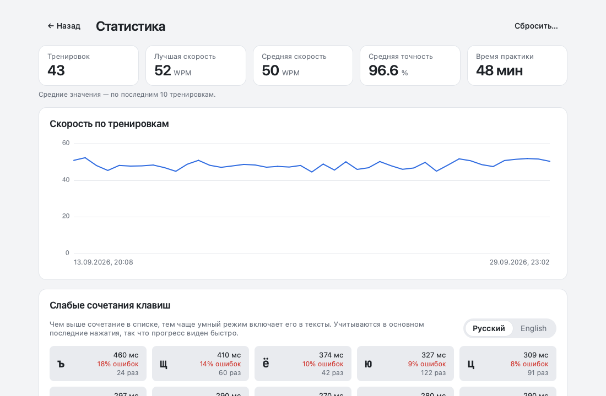

<p align="center">
  Тренажёр слепой печати для русского и английского языков.<br>
  Замеряет скорость и ошибки на каждом сочетании букв и подбирает текст под самые слабые из них.
</p>

<p align="center">
  
  
  
  
  
</p>

<p align="center">
  
</p>

## Возможности

- **Умный режим.** Для каждой буквы и сочетаний из 2-3 букв копятся средний интервал перед нажатием и доля ошибок. Текст собирается из словаря (около 1400 слов на язык) с упором на слова, где встречаются самые слабые сочетания. Старые замеры постепенно забываются, поэтому подборка следует за прогрессом.
- **Свой текст.** Любой текст приводится к набираемому виду: "ёлочки", длинные тире, многоточия и лишние пробелы заменяются символами с клавиатуры. Переносы строк и отступы сохраняются, так что можно тренироваться и на коде: в конце строки нажимается `Enter`, а отступ проходится сам. Длинные тексты показываются страницами по 2000 символов, поэтому скорость отклика не зависит от длины текста.
- **Метрики.** WPM, знаки в минуту, точность и ритм (ровность интервалов между нажатиями). Время считается с первой буквы, паузы в него не входят.
- **Итоги и статистика.** После тренировки - результат, отметка о рекорде и проблемные сочетания этой сессии. На экране статистики - история, график скорости и слабые сочетания за всё время.
- **Мелочи набора.** Подсказка о неверной раскладке вместо засчитанной ошибки, автопауза при простое и уходе в другое окно, светлая, тёмная и чёрная темы, встроенный шрифт JetBrains Mono.



## Установка

Готовые сборки - на странице [релизов](https://github.com/TihonSotnikov/TypingTrainer/releases/latest):

| Платформа | Файл |
| --- | --- |
| Windows x64 | `TypingTrainer-<версия>-windows-x64.zip` - распаковать и запустить `TypingTrainer.exe` |
| macOS 13+ (Apple Silicon и Intel) | `TypingTrainer-<версия>-macos-universal.dmg` - перенести приложение в Applications |
| Linux x86_64 | `TypingTrainer-<версия>-linux-x86_64.AppImage` |

Сборка для macOS не нотаризована Apple. AppImage запускается после выдачи прав на исполнение:

```bash
chmod +x TypingTrainer-*-linux-x86_64.AppImage
./TypingTrainer-*-linux-x86_64.AppImage
```

## Сборка

Требования: CMake 3.21+, компилятор с поддержкой C++20, Qt 6.5+ (модули Quick и QuickControls2). Библиотека nlohmann/json берётся из системы, а при её отсутствии скачивается при конфигурации.

```bash
cmake -S . -B build -DCMAKE_BUILD_TYPE=Release
cmake --build build --parallel
```

Если CMake не находит Qt, путь к нему передаётся через `-DCMAKE_PREFIX_PATH`. Приложение появляется в `build/src/frontend` (на macOS - `TypingTrainer.app`). Автономный дистрибутив со всеми библиотеками Qt на Windows и macOS (с Qt из официального установщика, как в CI):

```bash
cmake --install build --prefix "$PWD/dist"
```

## Использование

| Клавиша | Действие |
| --- | --- |
| `Enter` | новый текст; в режиме своего текста - изменить текст |
| `Tab` | начать текущий текст заново |
| `Esc` | пауза и продолжение; после завершения - показать набранный текст |
| `Backspace` | исправить предыдущий символ |

В конце строки своего текста `Enter` переводит строку, а на паузе продолжает тренировку - как и набор следующей буквы. Статистика, история и свой текст хранятся в каталоге данных пользователя; путь к нему показан в настройках, а переменная окружения `TYPING_TRAINER_DATA_DIR` задаёт другой каталог.

## Архитектура

- `src/backend` - ядро без зависимости от Qt: сессия набора, метрики, статистика сочетаний, генератор текста, хранение в JSON с атомарной записью.
- `src/contracts.hpp` - контракт между интерфейсом и ядром: команды и события в виде `std::variant`.
- `src/frontend` - интерфейс на QML и адаптер, который переводит события ядра в свойства Qt.

Ядро работает в отдельном потоке и общается с интерфейсом через потокобезопасные очереди, поэтому ввод не ждёт записи на диск и пересчёта статистики.

## Тестирование

90 тестов ядра на GoogleTest и UI-тест на Qt Test, который прогоняет настоящий интерфейс без экрана: набор, паузу, раскладку, свой текст, итоги, статистику, настройки и темы. CI собирает и тестирует проект на Windows, macOS и Linux, включая сборку с минимальной версией Qt 6.5.

```bash
cmake --preset dev
cmake --build --preset dev
ctest --preset dev
```

Только ядро, без Qt:

```bash
cmake --preset core
cmake --build --preset core
ctest --preset core
```
